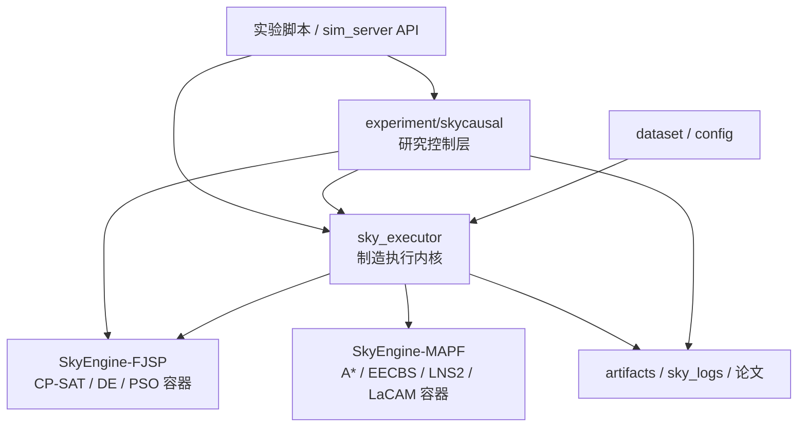
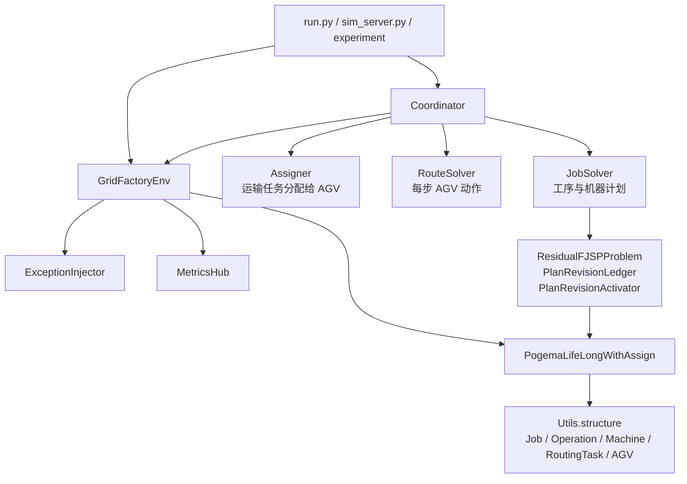

# SkyExecutor 与当前项目架构说明

日期：2026-08-11

关联专项调研：

- [`SkyEngine 0704insert` 分支调研](20260811_SkyEngine_0704insert分支调研.md)：运行时插单、
  特急抢占、远程重排契约及其与当前 SkyCausal 主链路的关系。

## 1. 先给结论

`sky_executor` 没有被 SkyCausal 丢弃。它仍然是当前项目的制造执行与仿真内核，负责：

```text
工序状态
+ 机器加工
+ AGV 运输
+ 路径动作执行
+ 异常注入
+ 物理时钟
+ 指标收集
+ 状态快照/恢复
+ 计划原子激活
```

近期新增的大量代码位于 `experiment/skycausal`，因为求解器目录、MCTS、probe 预算分配、
freshness 排序和 cohort 分析属于研究控制层，不应直接塞入物理执行内核。

但是，用户感觉“没有怎么使用 `sky_executor`”也有现实依据：

1. 最近的 30 状态 cohort 在宿主机 `.venv` 中直接 import `sky_executor`，没有启动
   `skyengine` engine 容器；
2. 只有 CP-SAT、DE、PSO 被作为独立 Docker 服务运行；
3. 最新 cohort 固定使用本地 `liveness_guard` 路由和 `nearest` 分配，没有动态选择
   MAPF solver 或 Assigner；
4. `sim_server.py` 的 HTTP/SSE 平台接口没有进入论文实验主链路。

因此准确说法是：

```text
sky_executor 的领域执行语义被深度复用；
skyengine 的 Docker/API 部署壳在近期 cohort 中没有被使用；
MAPF 与 Assigner 的开放元选择尚未接入。
```

## 2. 当前项目的仓库级架构



各层职责：

| 层 | 目录/仓库 | 主要职责 |
|---|---|---|
| 执行层 | `SkyEngine/sky_executor` | 物理状态、制造推进、运输、路由执行、异常、指标、计划激活 |
| 研究控制层 | `SkyEngine/experiment/skycausal` | Solver Catalog、probe、MCTS、Q、freshness、实验协议和分析 |
| FJSP 服务层 | `SkyEngine-FJSP` | CP-SAT、DE、PSO 等无状态/可观测 HTTP 求解器 |
| MAPF 服务层 | `SkyEngine-MAPF` | A*、LaCAM、PIBT、EECBS、PBS、LNS2 等 HTTP 路由服务 |
| 批处理入口 | `SkyEngine/run.py` | 环境变量驱动的单 episode 执行 |
| 在线 API 入口 | `SkyEngine/sim_server.py` | create/play/pause/reset/stop、SSE、插单和人工异常 |
| 训练层 | `SkyEngine/trainer` | DQN/PPO/GRPO/蒸馏及 decision backend |

## 3. `sky_executor` 自身架构

### 3.1 核心分层



### 3.2 领域数据模型

`sky_executor/grid_factory/factory/Utils/structure.py` 定义主要运行时对象：

- `Job`：作业及其工序链；
- `Operation`：候选机器、加工时间、状态、优先级、实际开始/结束时间；
- `Machine`：位置、当前工序、输入队列、故障状态和维修时间；
- `RoutingTask`：物料来源、目的机器、装载状态、分配/取货/送达时间；
- `AGV`：位置、当前任务、故障状态和运行统计；
- `MachineConfig`、`JobConfig`：环境构造配置。

这些对象是 FJSP 与 MAPF 闭环的共享语义，不是单纯的 Gym observation。

### 3.3 环境外壳：`GridFactoryEnv`

`GridFactoryEnv` 是 PettingZoo `ParallelEnv`，内部包装
`PogemaLifeLongWithAssign`。它负责：

1. 初始化网格、机器与作业；
2. 将动作拆成 `job_actions`、`assign_actions`、`agent_actions`；
3. 统一推进工序、运输和 AGV；
4. 调用异常注入和指标收集；
5. 暴露 `observe()`、`get_state()`、`set_state()` 和 `fork()`。

反事实实验的完整快照包含：

```text
制造状态
Pogema 网格状态
异常注入器状态
指标历史
Python / NumPy 随机状态
Coordinator 及三个组件状态
动画历史
```

因此 SkyCausal 的 action-independent state 配对能力来自 `sky_executor`，不是 MCTS
自行构造的简化状态。

### 3.4 物理内核：`PogemaLifeLongWithAssign`

该类是实际制造语义所在，主要维护：

```text
machines / jobs
machine input_queue
pending / buffered / assigned / active transfers
AGV current/finished tasks
machine / AGV / map / job epoch
processing time sampler
```

关键物理约束：

- 前序工序未完成时，运输任务停在 `buffered_tasks`；
- AGV 先空载前往 source，再装载前往 destination；
- 送达后工序进入目标机器 `input_queue`；
- 机器按优先级、紧急预约和暂停恢复规则加工；
- 已装载运输是不可撤销物理承诺；
- 每步真实更新机器、运输、AGV 与异常状态。

### 3.5 协调器：`Coordinator`

每个物理步执行：

```python
job_decision = job_solver.plan(job_observation)
assign_decision = assigner.plan(task_observation)
route_decision = route_solver.plan(agent_observation)
```

输出：

```text
job_actions     -> 新的机器计划/运输请求
assign_actions  -> RoutingTask 分配给哪个 AGV
agent_actions   -> 每个 AGV 当前步移动动作
```

当前注册组件：

```text
JobSolver:
  http, online_fjsp, greedy

RouteSolver:
  astar, http, rolling_mapf_http, reservation_astar, liveness_guard

Assigner:
  adaptive_coupling, coupling_hungarian, fifo, greedy, hungarian,
  least_congestion, load_balance, nearest, nn, random, sjt, urgency
```

注册通过包递归 import + factory registry 完成。

### 3.6 单个物理步的严格顺序

```text
Coordinator.decide(observation)
    ├─ JobSolver.plan
    ├─ Assigner.plan
    └─ RouteSolver.plan
            ↓
GridFactoryEnv.step(actions)
    1. env_timeline += 1
    2. ExceptionInjector.step_context
    3. job_step
       └─ 接收新的 transfer_requests
    4. task_step
       ├─ 检查前序工序等物理约束
       ├─ buffered -> ready_to_assign
       ├─ machine_process
       └─ AGV 取货/送货/新任务绑定
    5. Pogema.step
       └─ 执行 AGV 移动
    6. 刷新 AGV 位置和事件敏感字段
    7. MetricsHub.on_step_end
```

这就是当前论文所说“连续物理时钟”的真实执行对象。

### 3.7 计划修订与原子激活

`sky_executor` 中新增了在线修订基础设施：

- `build_residual_problem`：从最新状态提取剩余 FJSP；
- `PlanRevisionLedger`：保存父子修订、输入/输出 hash、触发事件和状态；
- `OnlineFJSPGateway`：调用 FJSP HTTP 服务；
- `ReplayableHTTPJobSolver`：只在计划初始化或修订时求解，之后本地重放运输请求；
- `PlanRevisionActivator`：提交前检查范围与物理承诺，原子替换可取消任务；
- 激活失败时恢复环境、JobSolver 和 RouteSolver 状态。

`PlanRevisionActivator` 明确禁止：

- 修改已经进入机器队列或正在加工的工序；
- 改写已装载物料的运输；
- 提交不完整 repair scope；
- 将工序分配给非候选机器；
- 运输目的地与机器动作不一致。

## 4. SkyCausal 当前如何使用 `sky_executor`

### 4.1 真实调用链

```text
run_online_meta_instance.py
    ↓
创建 GridFactoryEnv
    ↓
创建 Coordinator
  JobSolver = online_fjsp
  RouteSolver = liveness_guard
  Assigner = nearest
    ↓
sky_executor 正常推进到可注入故障的状态
    ↓
ExceptionInjector 注入 machine_breakdown
    ↓
OnlineFJSPMetaController
    ├─ 从 sky_executor 提取 ResidualFJSPProblem
    ├─ 后台 RealtimePhysicalAdvancer 持续调用 Coordinator + env.step
    └─ 前台调用 CP-SAT / DE / PSO Docker 服务做 shadow probe
    ↓
读取 sky_executor 最新物理状态
    ↓
所有 bundle freshness/rebase
    ↓
PlanRevisionLedger.append
    ↓
PlanRevisionActivator.activate
    ↓
sky_executor 继续执行到 episode 结束
```

### 4.2 深度复用的部分

SkyCausal 当前直接依赖：

- `GridFactoryEnv` 和 `PogemaLifeLongWithAssign`；
- `Coordinator`；
- `ExceptionInjector`；
- `Job/Operation/Machine/RoutingTask/AGV`；
- `ResidualFJSPProblem`；
- `OnlineFJSPGateway`；
- `ReplayableHTTPJobSolver`；
- `PlanRevisionLedger`；
- `PlanRevisionActivator`；
- `MetricsHub`；
- 状态快照、恢复和反事实 fork；
- 本地 RouteSolver 与 Assigner。

`experiment/skycausal` 中至少 23 个 Python 文件直接 import `sky_executor`。

### 4.3 目前放在外层的部分

以下内容属于研究控制层，目前不在 `sky_executor`：

- Solver Catalog 与 manifest；
- `SolverOption` 和统一 `PortfolioMetaAction`；
- Root MCTS、逐轮淘汰、固定策略；
- probe orchestration 和灰盒轨迹；
- 状态执行价值 Q；
- freshness 后候选排序；
- cohort runner、统计分析和论文证据。

这种边界总体合理：`sky_executor` 应负责“世界如何运行和计划如何安全落地”，
`experiment/skycausal` 负责“试哪个算法以及如何分配研究预算”。

### 4.4 当前确实没有充分使用的部分

1. MAPF solver 没有进入统一动作 schema；
2. Assigner 没有进入元搜索；
3. 最近 30 状态 cohort 没有调用 `sim_server`；
4. 最近 cohort 没有使用 engine Docker 容器；
5. `Benchmark` 与 `DataCollector` 不是当前主实验入口；
6. 在线 API 的插单、SSE 和人工控制链路尚未与 SkyCausal meta-controller 合并；
7. 当前只支持单次 `machine_breakdown` 的主控制器分支。

## 5. Docker 架构

### 5.1 镜像关系

```text
skyengine
  Python + sky_executor + experiment + run.py

skyengine-online
  Python 依赖层
  + 运行时 bind mount sim_server.py / sky_executor

skyengine-fjsp-best
  CP-SAT HTTP service :8002

skyengine-fjsp-de
  DE HTTP service :8002

skyengine-fjsp-pso
  PSO HTTP service :8002

skyengine-mapf-*
  MAPF HTTP service :8001
```

FJSP 服务主要接口：

```text
GET  /health
POST /solve
GET  /progress/<request_id>
POST /stop/<request_id>
POST /cancel/<request_id>
```

MAPF 服务主要接口：

```text
GET    /health
POST   /plan
POST   /cancel/<request_id>
DELETE /session/<session_id>
```

### 5.2 四种运行方式

#### A. 宿主机直接运行

适合开发与调试：

```bash
cd 260601天工论文准备/codebase/SkyEngine
uv sync --frozen
uv run python run.py
```

如果选择 HTTP solver，需要自行启动相应容器，并设置 `FJSP_SERVICE_URL` /
`MAPF_SERVICE_URL`。

#### B. CPU smoke

`docker-compose.cpu.yaml` 启动：

```text
engine + mapf
```

默认 FJSP 使用本地 `greedy`，不是 FJSP HTTP 容器。

```bash
docker compose -f docker-compose.cpu.yaml \
  up --build --abort-on-container-exit
```

#### C. 单组合 batch

`docker-compose.yaml` 启动：

```text
engine + 一个 MAPF 容器 + 一个 FJSP 容器
```

```bash
FJSP_IMAGE=skyengine-fjsp-best:latest \
MAPF_IMAGE=skyengine-mapf-lacam:latest \
docker compose up --build --abort-on-container-exit \
  --exit-code-from engine
```

该模式适合固定组合，不适合一次同时 probe CP-SAT、DE、PSO。

#### D. 在线 API 服务

`docker-compose-online.yaml` 启动 `sim_server.py`：

```bash
docker network inspect skyengine-net >/dev/null 2>&1 \
  || docker network create skyengine-net

docker compose -f docker-compose-online.yaml up -d
curl http://localhost:8080/health
```

主要 API：

```text
POST /sim/create
POST /sim/play
POST /sim/pause
POST /sim/reset
POST /sim/stop
POST /sim/exception/inject
POST /sim/exception/clear
POST /sim/insert_jobs
GET  /sim/state
GET  /stream/state
GET  /stream/metrics
GET  /stream/events
```

### 5.3 当前 SkyCausal portfolio 的 Docker 用法

近期 cohort 的实际拓扑是：

```text
宿主机 Python:
  sky_executor + experiment/skycausal

Docker:
  CP-SAT :18202 -> :8002
  DE     :18203 -> :8002
  PSO    :18204 -> :8002
```

示例：

```bash
docker run -d --name sky-fjsp-cp  -p 18202:8002 \
  sha256:56e8c4c529bc33e110e27b5d84b4b03246375355223dac2863a7ff12433e75c4

docker run -d --name sky-fjsp-de  -p 18203:8002 \
  sha256:04b346e3e08af14a9a13f5a425b703de2884a53de7a0e8b34f97d42d8e8248ab

docker run -d --name sky-fjsp-pso -p 18204:8002 \
  sha256:12e8f6d18212dc5e23b4d1ad4ed8b2c3d103fea478be9437f0ccbeca30925016
```

然后宿主机运行：

```bash
uv run python -m experiment.skycausal.run_online_meta_instance \
  --endpoint fjsp.cp_sat=http://127.0.0.1:18202 \
  --endpoint fjsp.de=http://127.0.0.1:18203 \
  --endpoint fjsp.pso=http://127.0.0.1:18204 \
  ...
```

这解释了为什么最近看不到 `skyengine` 容器：执行内核作为 Python 包运行，只有算法
求解器处于 Docker 中。

## 6. 当前架构问题与建议

### 6.1 必须先澄清的命名

`sky_executor` 实际是“制造仿真执行内核”，不是通用 Docker executor。建议文档统一称：

```text
SkyExecutor Runtime / 制造执行内核
```

### 6.2 代码债务

1. `grid_factory.py` 与 `assign_env.py` 存在同名
   `PogemaLifeLongWithAssign`；当前热路径只使用 `assign_env.py`，前者应标记 legacy
   或移除；
2. 旧实验仍引用已经迁到 `experiment/pre_code/legacy_monitors` 的 monitor 类；
3. `sim_server.py` 同时承担 API、线程生命周期、SSE、插单、日志和状态序列化，已经是
   单文件控制面；
4. factory 通过递归 import 自动注册，扩展方便，但导入副作用和可审计性较弱；
5. 根目录 README 仍是产品宣传，不足以解释运行架构。

### 6.3 Docker 风险

1. `docker-compose.yaml` 将 `sky_executor` 以可写 bind mount 覆盖镜像内容，镜像 digest
   不能单独证明实际执行代码；正式实验应使用不可变镜像；
2. `docker-compose-online.yaml` 依赖外部网络 `skyengine-net`，首次运行前必须创建；
3. `online.dockerfile` 不复制源码，完全依赖 bind mount，不是自包含发布镜像；
4. `.dockerignore` 当前没有放行 `pyproject-online.toml`，而 `online.dockerfile`
   需要复制该文件，在线镜像干净重建存在失败风险；
5. GPU compose 固定了 NVIDIA 设备配置，不适合 macOS CPU 环境；
6. 最近的三 lane cohort 容器共享宿主机 CPU，严格 wall-clock probe 会受资源争用影响。

### 6.4 推荐的演进边界

保持：

```text
sky_executor:
  物理状态 + 执行语义 + 原子计划提交 + 可回放状态

experiment/skycausal:
  候选生成 + probe + MCTS/Q + 实验统计

solver containers:
  可取消、可审计、版本冻结的算法服务
```

下一步应补：

1. 将 `OnlineFJSPMetaController` 接入 `sim_server` 的事件处理接口；
2. 为 MAPF 建立与 FJSP 相同的 manifest/adapter/probe 契约；
3. 将 Assigner 作为独立动作因子，而不是直接扩成笛卡尔积；
4. 新建 portfolio compose 或容器启动器，一次声明多个 solver 和资源配额；
5. 正式确认时让 engine 与 solver 都运行不可变镜像，并记录完整 image digest；
6. 把 `sky_executor` 内部契约整理成稳定的 Runtime API，减少实验层访问私有方法
   `_partial_repair_scope`、`_merge_effective_schedule`。

## 7. 最终判断

当前项目不是：

```text
MCTS 取代 sky_executor
```

而是：

```text
SkyCausal 在 sky_executor 上方增加了求解器组合控制平面。
```

当前架构已经形成：

```text
外部 solver Docker 服务
        ↓
SkyCausal 研究控制层
        ↓
sky_executor 物理执行与安全提交层
```

真正尚未完成的是把这一研究控制平面产品化接入 `sim_server`，并把 MAPF 与 Assigner
从固定组件升级为开放候选。
